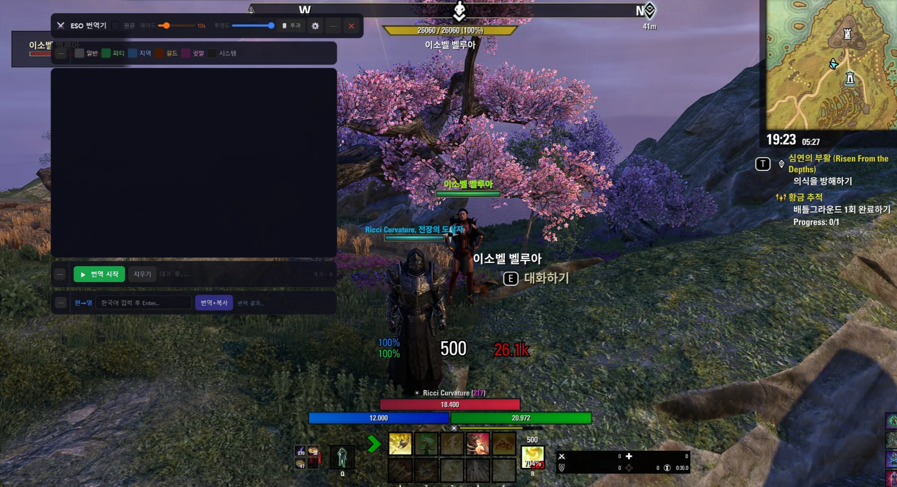
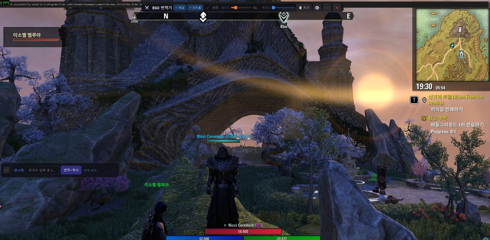
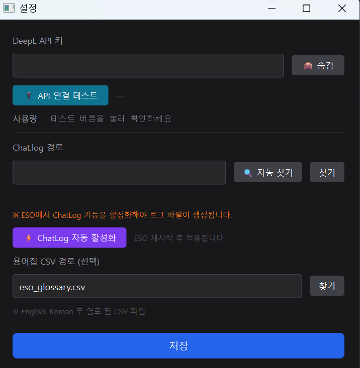
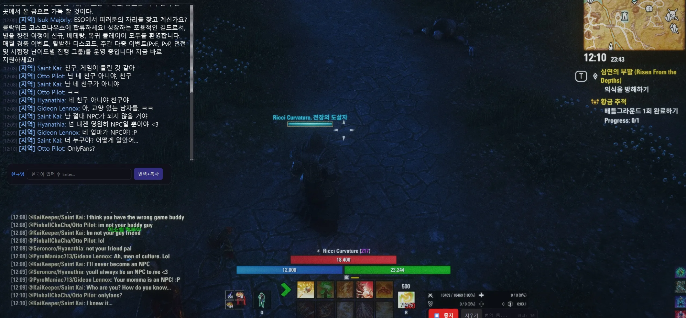
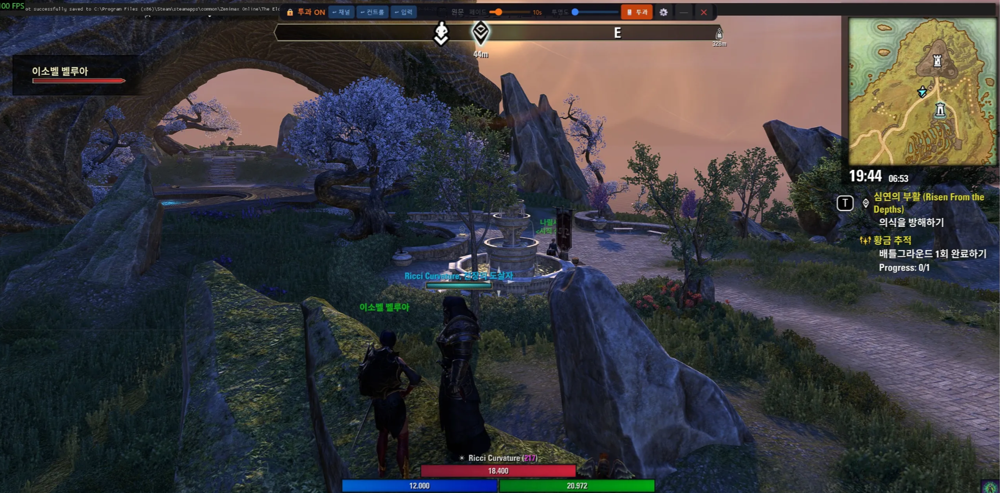

# ⚔ ESO 채팅 번역기

Elder Scrolls Online 채팅을 실시간으로 한국어로 번역해주는 오버레이 툴입니다.  
DeepL API를 사용하며, 게임 화면 위에 투명하게 띄워서 사용합니다.

---

## 미리보기

게임 화면 위에 오버레이로 띄운 모습입니다.



패널을 자유롭게 이동해서 원하는 위치에 배치할 수 있습니다.



---

## 주요 기능

- **실시간 채팅 번역** — ESO Chat.log를 감지해 영→한 자동 번역
- **패널 자유 배치** — 위치, 크기 조정 / 투명도, 페이드 인아웃 조절
- **한→영 입력 번역** — 한국어 입력 후 버튼 클릭 시 영어로 번역 + 클립보드 복사
- **채널 필터** — Say / Group / Zone / Guild / Whisper 채널별 ON/OFF
- **투과 모드** — 마우스 클릭이 게임으로 통과, 오버레이만 표시
- **용어집 지원** — CSV 파일로 고유명사 번역 커스터마이징
- **API 사용량 확인** — 설정창에서 DeepL 잔여 글자 수 확인
- **Chat.log 자동 감지 및 활성화** — ESO 설치 경로 자동 탐색 + 미활성화 시 자동 설정

---

## 설치 방법

### 방법 1 — exe 실행 (권장, Python 불필요)

1. [Releases](../../releases) 페이지에서 최신 버전 다운로드
2. 압축 풀기
3. `ESO_Translator.exe` 실행

> ⚠ Windows Defender가 경고를 띄울 수 있습니다.  
> `추가 정보` → `실행` 클릭하면 정상 실행됩니다.

### 방법 2 — Python으로 실행

```bash
pip install -r requirements.txt
python main.py
```

**요구사항:** Python 3.10 이상, Windows 10/11

---

## 초기 설정 (처음 실행 시)

### 1단계 — DeepL API 키 발급

1. https://www.deepl.com/pro-api 접속
2. 무료 플랜(Free) 가입
3. 계정 → `API Keys` 에서 키 복사
4. 월 **500,000자 무료** 제공
5. ESO 게임내에 /chatlog 명령어로 로그 생성
6. Deepl 번역 사이트와 API 사이트는 별개 이므로 반드시 확인하고 무료플랜 30일 이후 자동으로 결제가 이뤄지므로, 
원치 않을시 무료 플랜 가입후 계정내에서 구독을 취소하면 30일 무료플랜 이후 결제는 이뤄지지 않음. 반드시 확인. 

### 2단계 — 툴 설정

툴 실행 후 타이틀 바 오른쪽의 **⚙ 버튼**을 클릭합니다.


설정창이 열립니다.



**① API 키 입력**
- `DeepL API 키` 입력란에 발급받은 키를 붙여넣기
- `👁 표시` 버튼으로 입력 내용 확인 가능
- `🔌 API 연결 테스트` 버튼으로 연결 확인
- 성공 시 `✅ 연결 성공` 및 잔여 사용량 표시

**② Chat.log 경로 설정**
- `🔍 자동 찾기` 버튼 클릭 → ESO 로그 파일 자동 탐색
- 파일이 없다면 `⚡ ChatLog 자동 활성화` 버튼 클릭 → ESO 재시작 후 다시 자동 찾기


**③ 저장** 버튼 클릭

### 3단계 — 번역 시작

하단 패널의 **▶ 번역 시작** 버튼을 클릭하면 채팅 감지가 시작됩니다.


ESO에서 채팅이 올라오면 자동으로 번역되어 표시됩니다.



---

## 화면 구성 및 버튼 설명

**타이틀 바**


**채널 패널**


**하단 패널**


**한→영 입력 패널**


| 위치 | 버튼 | 설명 |
|------|------|------|
| 타이틀 바 | `⚙` | 설정창 열기 |
| 타이틀 바 | `─` | 패널 전체 최소화 |
| 타이틀 바 | `✕` | 툴 종료 |
| 타이틀 바 | `🖱 투과` | 클릭 투과 ON/OFF |
| 타이틀 바 | `투명도 슬라이더` | 채팅 패널 투명도 조절 |
| 타이틀 바 | `페이드 슬라이더` | N초 후 채팅 자동 페이드 (0=끔) |
| 채널 패널 | 각 채널 버튼 | 일반 / 파티 / 지역 / 길드 / 귓말 / 시스템 필터 |
| 하단 패널 | `▶ 번역 시작` / `⏹ 중지` | 채팅 감지 시작/정지 |
| 하단 패널 | `지우기` | 채팅 패널 내용 지우기 |
| 입력 패널 | 텍스트 입력란 | 한국어 입력 |
| 입력 패널 | `번역+복사` | 한→영 번역 후 클립보드에 복사 |

---

## 투과 모드 사용법

오버레이를 게임 위에 띄운 채로 게임을 플레이할 때 사용합니다.

1. 타이틀 바의 `🖱 투과` 버튼 클릭
2. 채팅 패널이 투과 상태가 됨 (마우스 클릭이 게임으로 통과)
3. **한→영 입력창은 투과 모드에서도 정상 사용 가능**
4. 다시 `🖱 투과` 클릭하면 해제



---

## 한→영 번역 사용법

ESO 채팅창에 영어로 입력해야 할 때 사용합니다.

1. 하단 입력창에 한국어 입력
2. `번역+복사` 버튼 클릭
3. 번역 결과가 오른쪽에 표시되고 **클립보드에 자동 복사**
4. ESO 채팅창에 `Ctrl+V` 로 붙여넣기


---

## 용어집 커스터마이징

`eso_glossary.csv`를 메모장이나 엑셀로 열어 편집합니다.  
첫 번째 열에 영어, 두 번째 열에 한국어를 입력하세요.

```
English,Korean
Warden,워든
Dragonknight,드래곤나이트
Tamriel,탐리엘
Vestige,방랑자
LFG,그룹 구합니다
LFM,멤버 구합니다
```

설정창 `용어집 CSV 경로`에서 파일 경로를 지정하면 반영됩니다.

---

## 보안 및 안전성

**이 툴은 ESO 게임 파일을 건드리지 않습니다.**

| 항목 | 내용 |
|------|------|
| 게임 파일 접근 |  없음 |
| 게임 메모리 접근 |  없음 |
| 네트워크 통신 |  DeepL API 서버에만 번역 요청 |
| 저장하는 데이터 | 설정(config.json), 번역 캐시(translation_cache.json) — 로컬에만 저장 |

**동작 방식:**  
ESO가 자동으로 생성하는 `ChatLog.log` 텍스트 파일을 읽는 것이 전부입니다.  
게임 클라이언트와 직접적인 통신은 전혀 없습니다.

**소스코드 공개:**  
이 저장소에 전체 소스코드가 공개되어 있습니다.  
`core/`, `ui/` 폴더에서 직접 확인하실 수 있습니다.  
신뢰가 안 된다면 `python main.py`로 직접 소스코드를 실행하셔도 됩니다.

**DeepL API 키:**  
입력한 API 키는 `config.json`에 로컬 저장되며, DeepL 서버 외에 다른 곳으로 전송되지 않습니다.

> ZeniMax/Bethesda의 외부 툴 정책상 로그 파일 읽기는 허용 범위 내에 해당합니다.  
> 매크로, 봇, 게임 메모리 조작 등과는 무관합니다.

---

## 자주 묻는 질문

**Q. 번역이 안 돼요**  
A. 설정창 → `🔌 API 연결 테스트`로 키 확인. 오류 메시지를 참고하세요.

**Q. Chat.log 자동 찾기가 실패해요**  
A. `⚡ ChatLog 자동 활성화` 버튼을 누른 후 ESO를 재시작하고 다시 자동 찾기를 눌러보세요.  
그래도 안 되면 직접 찾기로 경로를 지정하세요.  
기본 경로: `C:\Users\사용자명\Documents\Elder Scrolls Online\live\Logs\ChatLog.log`

**Q. Windows Defender가 차단해요**  
A. `추가 정보` → `실행` 클릭. 개인 제작 툴이라 서명이 없어서 발생하는 경고입니다.

**Q. 채팅이 너무 빠르게 지나가요**  
A. 타이틀 바의 `페이드 슬라이더`를 오른쪽으로 조절해 표시 시간을 늘릴 수 있습니다.

---

## 🛠 기술 스택

- Python 3.11 / PyQt6
- DeepL API
- PyInstaller

---

## 라이선스

MIT License